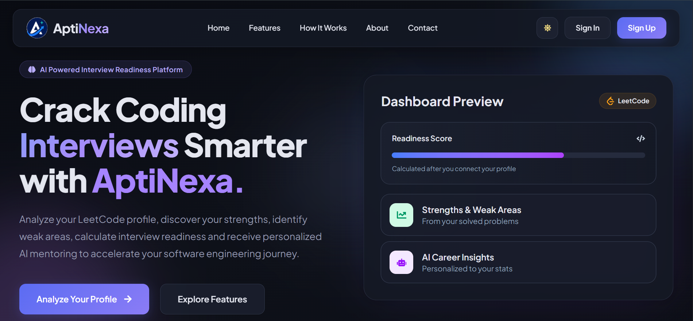
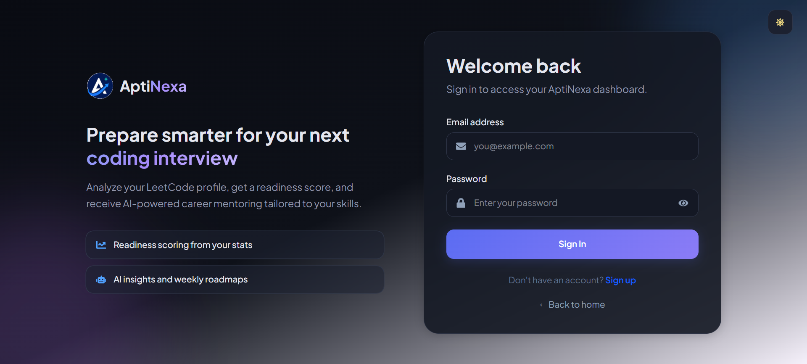
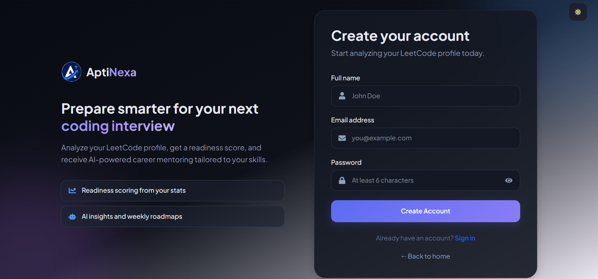
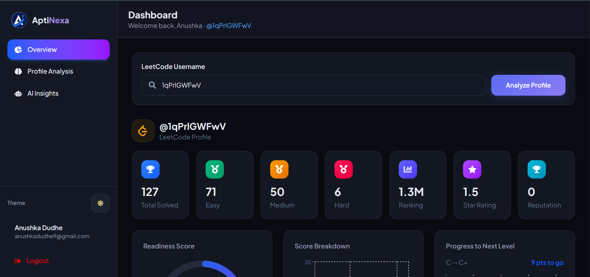
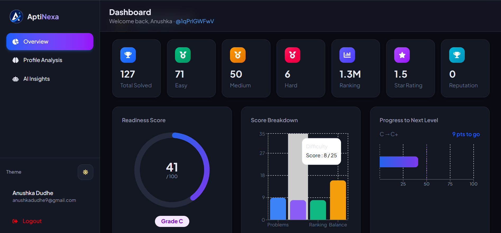
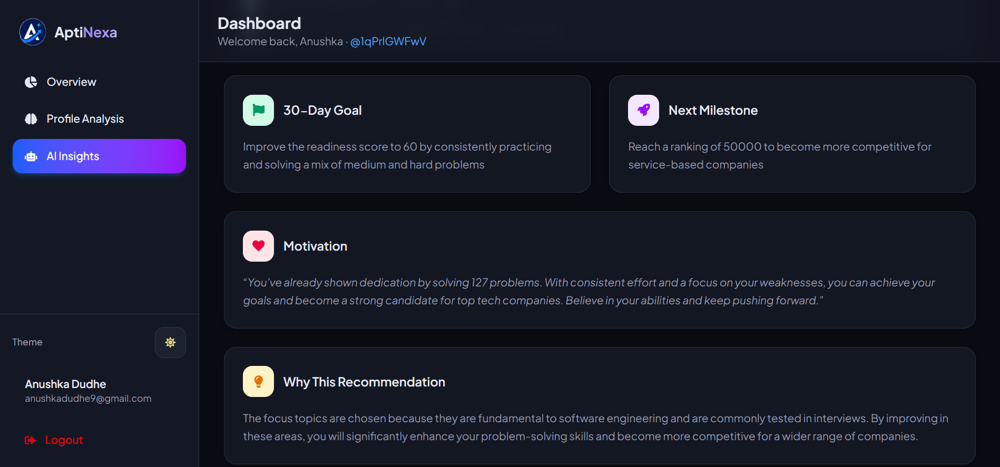

# 🚀 AptiNexa – AI-Powered Placement Readiness & Career Insights Platform

<p align="center">
  
</p>

<p align="center">
  <b>Analyze • Improve • Get Interview Ready</b>
</p>

<p align="center">
An AI-powered placement readiness platform that analyzes a student's LeetCode profile, evaluates coding performance, and generates personalized AI-driven career insights, interview strategies, and learning roadmaps to help users prepare for software engineering placements.
</p>

---

# 🌐 Live Demo

- **Frontend:** https://aptinexa-luh3xefkz-logicvortex123s-projects.vercel.app
- **Backend API:** https://aptinexa-backend.onrender.com

---

# 📖 About AptiNexa

AptiNexa is a full-stack AI-powered placement readiness platform designed to help aspiring software engineers understand and improve their coding performance.

Instead of simply displaying LeetCode statistics, AptiNexa intelligently analyzes a user's coding profile and transforms raw data into meaningful insights, helping students identify strengths, address weaknesses, and prepare strategically for technical interviews.

The platform combines real-time LeetCode analytics with AI-generated recommendations to create a personalized coding mentor experience.

Users receive:

- 📊 Placement Readiness Score
- 🎯 Personalized Profile Grade
- 📈 Performance Analytics
- 💪 Strength Analysis
- ⚠️ Weak Area Detection
- 🧠 AI-Generated Career Summary
- 🗓 Personalized Weekly Learning Roadmap
- 🎤 Interview Preparation Tips

---

# ✨ Features

## 🔐 Authentication

- Secure User Registration
- User Login
- JWT-based Authentication
- Protected Dashboard
- Persistent User Sessions

---

## 📊 LeetCode Profile Analysis

Analyze any public LeetCode profile to get:

- Total Problems Solved
- Easy / Medium / Hard Problem Distribution
- Global Ranking
- Reputation
- Contest Rating
- Comprehensive Coding Statistics

---

## 📈 Placement Readiness Analysis

AptiNexa intelligently evaluates coding performance and generates:

- Overall Placement Readiness Score
- Personalized Profile Grade
- Score Breakdown
- Progress Towards Next Level
- Performance Evaluation

---

## 🎯 Personalized Performance Insights

Automatically identifies:

- Strong Problem-Solving Areas
- Weak Concepts
- Personalized Improvement Suggestions
- Coding Performance Trends

---

## 🤖 AI Career Coach

Powered by a **Large Language Model (LLM)** through the **Groq API**, AptiNexa generates:

- Personalized Career Summary
- Weekly Learning Roadmap
- Interview Preparation Tips
- Skill Improvement Recommendations

Every recommendation is tailored according to the user's LeetCode profile and coding performance.

---

## 📉 Interactive Dashboard

The dashboard provides a clean and interactive experience with:

- Readiness Score Visualization
- Problem Distribution Charts
- Progress Analytics
- Performance Cards
- AI Insights Section
- Coding Statistics Overview

---

## 🌙 Modern User Experience

- Responsive Design
- Dark / Light Theme
- Smooth Animations
- Interactive UI
- Clean Dashboard Layout

---

# 🛠 Tech Stack

## 🎨 Frontend

- React.js
- Vite
- React Router DOM
- Axios
- Framer Motion
- Recharts
- React Hot Toast
- React Icons
- HTML5
- CSS3
- JavaScript (ES6+)

---

## ⚙️ Backend

- Node.js
- Express.js
- MongoDB
- Mongoose
- JWT (JSON Web Token)
- bcrypt.js
- Axios
- CORS
- dotenv

---

## 🤖 AI Integration

- Groq API
- Large Language Model (LLM)

---

## 🌐 External APIs

- LeetCode GraphQL API

---

## 🚀 Deployment

- Vercel (Frontend)
- Render (Backend)

---

# 📂 Project Structure

```text
AptiNexa
│
├── client
│   ├── public
│   ├── src
│   │   ├── assets
│   │   ├── components
│   │   ├── context
│   │   ├── hooks
│   │   ├── pages
│   │   ├── services
│   │   ├── utils
│   │   ├── App.jsx
│   │   └── main.jsx
│   │
│   ├── package.json
│   └── vite.config.js
│
├── server
│   ├── config
│   ├── controllers
│   ├── middleware
│   ├── models
│   ├── routes
│   ├── services
│   ├── utils
│   ├── server.js
│   └── package.json
│
└── README.md
```

---

# ⚙️ Installation

## Clone the Repository

```bash
git clone https://github.com/LogicVortex123/AptiNexa.git
```

---

## Install Frontend

```bash
cd client
npm install
npm run dev
```

---

## Install Backend

```bash
cd server
npm install
npm run dev
```

---

# 🔑 Environment Variables

## Backend (.env)

```env
MONGO_URI=your_mongodb_connection_string

JWT_SECRET=your_secret_key

GROQ_API_KEY=your_groq_api_key
```

---

## Frontend (.env)

```env
VITE_API_URL=http://localhost:5000/api
```

> For production deployment, update the value of `VITE_API_URL` to your deployed backend endpoint.

---

# 📸 Screenshots

<table align="center">

<tr>
<td colspan="2" align="center">

### 🏠 Landing Page



</td>
</tr>

<tr>
<td align="center">

### 🔐 Sign In



</td>

<td align="center">

### 📝 Sign Up



</td>
</tr>

<tr>
<td align="center">

### 📊 Dashboard



</td>

<td align="center">

### 📈 Analysis



</td>
</tr>

<tr>
<td colspan="2" align="center">

### 🤖 AI Career Mentor



</td>
</tr>

</table>

# 🚀 Future Enhancements

- AI Resume Analyzer
- ATS Resume Score Checker
- Resume Builder
- Company-wise Preparation Roadmaps
- Coding Contest Tracker
- Daily Coding Challenges
- Mock Technical Interview Simulator
- Behavioral Interview Preparation
- Skill Progress Tracking
- Gamification & Achievement Badges
- Personalized Learning Paths

---

# 🎯 Why AptiNexa?

Preparing for software engineering placements often requires using multiple platforms to track coding progress, identify improvement areas, and prepare for interviews.

AptiNexa simplifies this journey by combining coding analytics with AI-powered recommendations into a single intelligent platform. It helps students understand their current readiness, improve strategically, and build confidence for technical interviews.

---

# 👩‍💻 Author

**Anushka Dudhe**

GitHub: https://github.com/LogicVortex123

LinkedIn: https://www.linkedin.com/in/anushka-dudhe-22549b369/

---

# ⭐ Show Your Support

If you found this project helpful, consider giving it a ⭐ on GitHub.

Your support motivates me to build more impactful and innovative projects.

---

<p align="center">
Made with ❤️ by <b>Anushka Dudhe</b>
